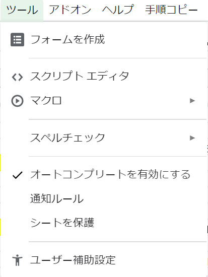
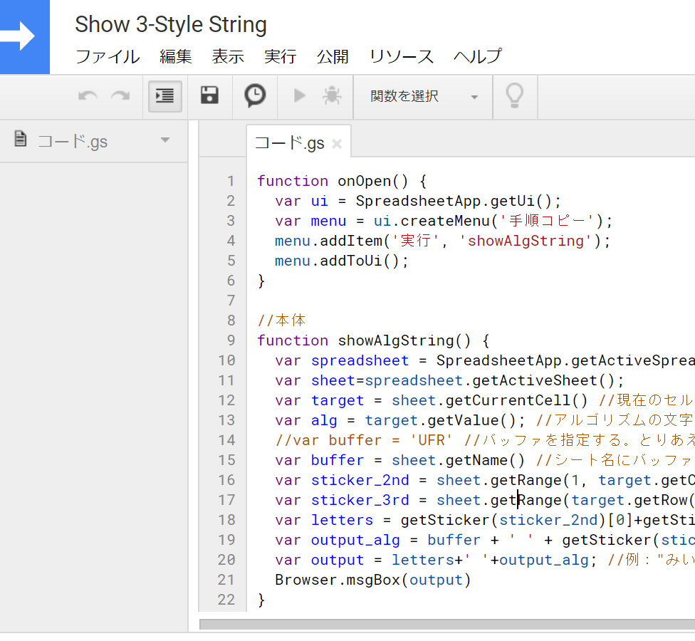
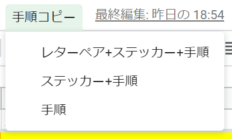

# showAlgString
3-Style手順表からコピペ用の文字列を出力するためのGoogle Apps Scriptです。自分の使っている手順とレターペアをコピーして、シェアしたいときに便利なスクリプトです。

## 動作要件
### 前提
- Google スプレッドシート上に3-Style手順表がある
- エッジおよびコーナーのどちらでも動作する
- シート名にバッファが書いてある
- PC上のブラウザからアクセスしている (iPhoneなどのスプレッドシートアプリではスクリプトを実行できない)

### 動作確認済みの手順表
- [まっさん手順 – Google Sheets](https://docs.google.com/spreadsheets/d/1mHlpvaKb9Emi1ach6vsMcQwBY4mNSJ0ncn5fnVOzojE/edit#gid=337645627)
- [Graham’s Full 3Style Comm Series + more](https://docs.google.com/spreadsheets/d/1-AnKGJMHN3SAOcZxem3XJ5tBm7Dk1dTRcZ7KcXYbGP4/)
- [Jack’s Comms – Google Sheets](https://docs.google.com/spreadsheets/d/1yl5Xwn2aDpXyHA0Rx1OUrDzec8nbg18wxis3I4uDoIw/edit)

## インストール方法
1. Googleスプレッドシートの **[ツール]>[スクリプトエディタ]** を選択する

2. `showAlgString.js` の中身をコピペする

3. アクセス権限の許可をする

> おそらくGASのもっと良い共有方法があるはずだけれど、詳しくないので雑な方法で公開する。

## 使い方
1. 手順表からコピーしたい手順を選択する。複数の手順を指定することもできる。Ctrlを使ってバラバラのセルを指定することもできる。
2. 上部にある **[手順コピー]** から、下記の表示形式のどれかを選択する。

| 表示形式                      | 出力の例                             |
| :---------------------------- | :----------------------------------- |
| 1. レターペア+ステッカー+手順 | **"みい UFR RDF UFL [U', R' D' R]"** |
| 2. ステッカー+手順            | **"UFR RDF UFL [U', R' D' R]"**      |
| 3. 手順                       | **"[U', R' D' R]"**                  |
| 4. レターペア+ステッカー+手順+展開 | **"みい UFR RDF UFL [U', R' D' R] U' R' D' R U R' D R"** |
| 5. ステッカー+手順+展開            | **"UFR RDF UFL [U', R' D' R] U' R' D' R U R' D R"**      |
| 6. 手順+展開                       | **"[U', R' D' R] U' R' D' R U R' D R"**                  |
| 7. 展開                       | **"U' R' D' R U R' D R"**                  |

3. 画面上にポップアップウィンドウが現れるので、表示された文字列をコピーする

4. Twitterなどに貼り付けて楽しむ。

**Have a nice speedcubing!**

## バージョン履歴
### v1.0 (2020/04/21)
- リリース。まっさんの手順表に対応した。
### v1.1 (2020/04/21)
- レターペアのない手順表(Jack Cai、Graham Siggins)に対応した。
### v1.2 (2020/04/22)
- 出力形式を増やした。レターペアを出力しなくてもいいときもありますよね。
### v1.3 (2020/04/26)
- 複数範囲の出力に対応した。Ctrlで離散的なセルを選択しても動作する。
### v1.4 (2020/05/05)
- コミューテータ表記の展開に対応した。
### v1.5.1 (2020/05/06)
- コミューテータ表記の展開のバグを修正した。
- 展開したときに自動的に手順間でキャンセルをするよう関数を定義した。
### v1.5.2  (2020/05/09
- 手順キャンセルのバグを修正した
- 連続していない回転でもキャンセルできるように修正した。(`U D U D U2 D' U2` = `U2 D`)
- 回転記号はキャンセルしないように修正した。

## 謝辞
素晴らしい3-Style手順表を作成してくださった先人の成果に感謝します！

