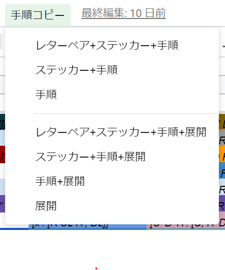

# showAlgString
3-Style手順表からコピペ用の文字列を出力するためのGoogle Apps Scriptsです。

## 前提条件
- Google スプレッドシート上に3-Style手順表があること

## インストール方法
1. Googleスプレッドシートの **[ツール]>[スクリプトエディタ]** を選択する

2. `showAlgString.js` の中身をコピペする

3. アクセス権限の許可をする

> おそらくGASのもっと良い共有方法があるはずだけれど、詳しくないので雑な方法で公開する。

## 使い方
1. 手順表からコピーしたい手順を選択する
2. 上部にある **[手順コピー]>[実行]** を選択する

3. 画面上にポップアップウィンドウが現れるので、表示された文字列をコピーする

4. Twitterなどに貼り付ける

**Have a nice speedcubing!**

## 謝辞
素晴らしい3-Styleを作成してくださった先人の成果に感謝します！